# Wulo-work DPIA Desk — POC feature guide

This is the black-and-white **Wulo-work** POC built on Omnigent. The DPIA Desk is an
**additive** feature set: the underlying chat, sessions, automations, and settings
surfaces remain available alongside a case cockpit for running a UK GDPR **DPIA
screening** on a synthetic case ("Student Success Alert"). Everything runs on synthetic
data; agents only ever **propose** — a human Privacy Officer applies.

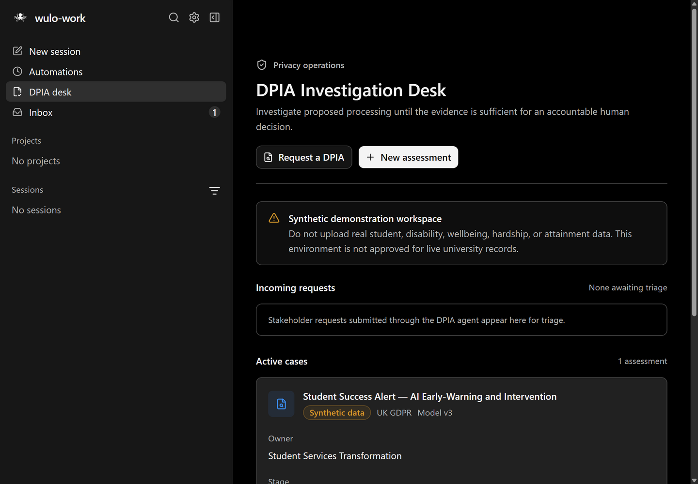

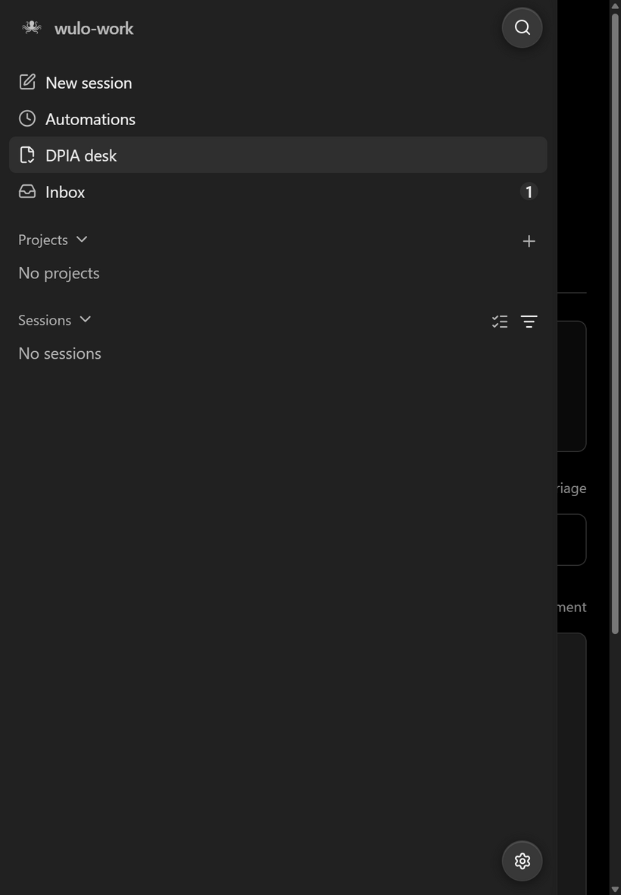

**Run it locally**

```bash
uv run --no-sync omnigent server --host 127.0.0.1 --port 6777 --agent examples/dpia_investigation --no-open
cd web && OMNIGENT_URL=http://127.0.0.1:6777 pnpm exec vite --host 127.0.0.1 --port 5178
```

Open http://127.0.0.1:5178/dpia/cases/student-success-alert.

---

## The big picture

| Piece | Where | What it does |
|---|---|---|
| Case snapshot | durable `/v1/dpia/cases/<caseId>` store with revision history | One version-checked JSON document holding the whole case: processing model, evidence, findings, questions, proposals, officer decision, audit log. A valid legacy `localStorage` snapshot is migrated once and removed only after the server acknowledges it. |
| Case cockpit UI | `web/src/pages/dpia/` | The pages and cards below |
| Case logic | `web/src/lib/dpia/` | Pure functions: every mutation takes a snapshot, returns a new validated snapshot (zod-strict), and appends an audit event |
| Agent bundle | `examples/dpia_investigation/` | Coordinator + 3 sub-agents that run a live investigation and draft corrections |

**Core data objects**

- **Processing model** — versioned list of *facts* (purpose, data subjects, hosting, retention…). Changing a *material* fact bumps `version` and marks dependent findings stale.
- **Evidence** — register of synthetic documents/responses, each `current` or `superseded`.
- **Determinations (findings)** — per-dimension conclusions, pinned to the model version they were made against.
- **Stakeholder questions** — open questions; answers are attributed and become evidence.
- **Correction proposals** — pending changes drafted by the agent or manually; only an officer can apply.
- **Officer decision** — accept/override with rationale, pinned to model + policy versions.
- **Audit log** — append-only event list of everything above.

**The one algorithm to know — readiness** (`web/src/lib/dpia/readiness.ts`)

Each of 8 screening dimensions declares required fact ids. The status is derived, in
priority order:

1. `stale-after-change` — a required fact changed after the finding was reviewed
2. `missing-evidence` — a required fact is empty or has no usable evidence
3. `needs-judgement` — an unresolved material contradiction touches the dimension
4. `answerable` — facts present, evidenced, uncontradicted

The banner "5/8 determination areas answerable" is just the count of dimensions in
state 4. It is inspectable maths, not model confidence.

**The agents** (`examples/dpia_investigation/config.yaml`)

| Agent | Role |
|---|---|
| `dpia-investigation` (coordinator) | Talks to the officer, orchestrates the run, drafts correction proposals — proposal-only, it never edits the case itself |
| Process Investigator | Builds the processing map from intake + evidence |
| Privacy Assessor | Stage-1 **blind** assessment: it only sees a sanitized package (`prepare_stage_one.py`), frozen with a sha256 hash |
| Independent Verifier | Reviews the assessment; if it can prove the blind was compromised it fails the run (exit code 3) |

Every artifact the agents produce is validated by `schemas/validate_artifact.py`
(JSON Schema + relational gates: version math, evidence refs must exist, dimension
coverage, frozen Stage-1 hash).

---

## 1. Sidebar — DPIA desk entry + attention badge

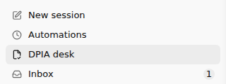

- **What:** "DPIA desk" nav item; the Inbox badge counts DPIA items needing attention.
- **Data in:** all case snapshots → `countDpiaAttentionItems` (`web/src/lib/dpia/inbox.ts`).
- **Outcome:** one click to the portfolio; the badge tells the officer work is waiting.

## 2. Inbox — DPIA cases section

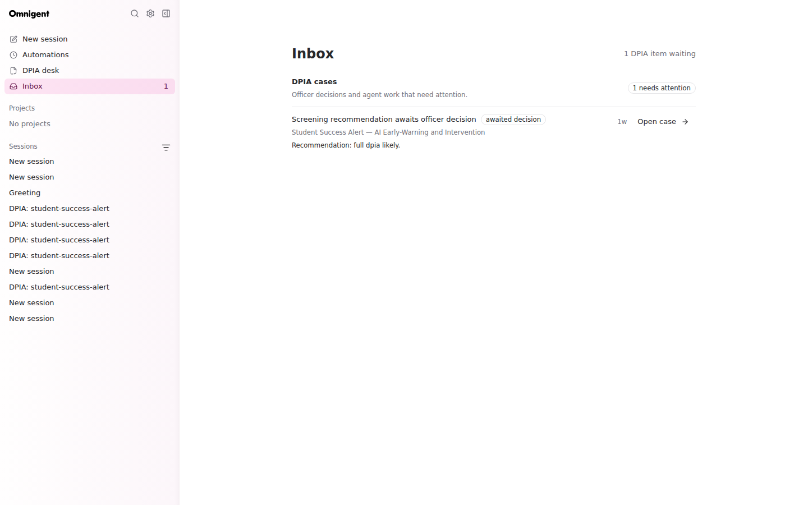

- **What:** an always-visible "DPIA cases" section inside the existing Inbox. This is where you see the *jobs of the agents* and what needs a human.
- **Data in:** case snapshots → `deriveDpiaAttentionItems` derives four item kinds:
  - `pending-proposal` — a correction proposal awaits officer review (medium)
  - `stale-finding` — a finding went stale after a fact changed (high)
  - `failed-live-run` — the live agent investigation failed (high)
  - `awaited-decision` — screening recommendation has no officer decision yet (medium)
- **Outcome:** each row deep-links into the exact case tab (e.g. `?tab=screening`) so the officer lands on the thing to fix.

## 3. DPIA desk — portfolio

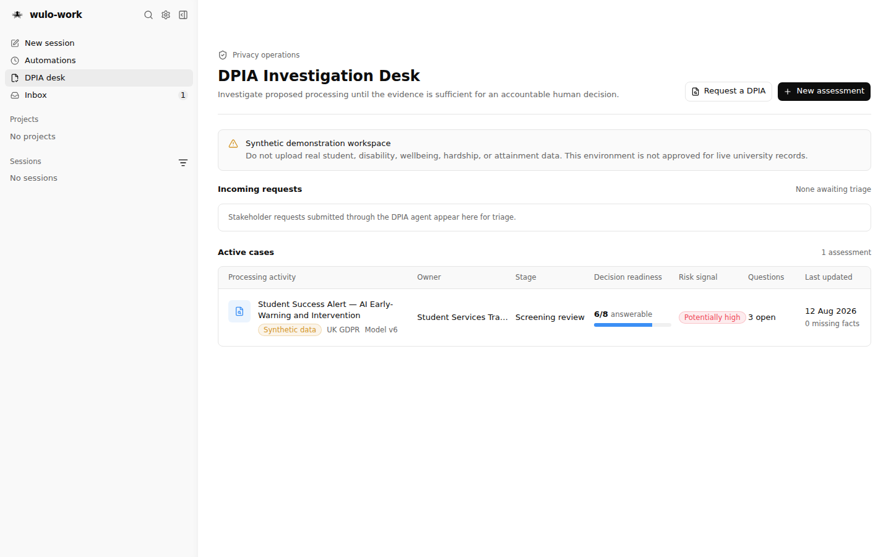

- **What:** `/dpia` — list of assessments with readiness, recommendation, and status chips (cached snapshot vs live run vs failed are visually distinct).
- **Input:** none — reads snapshots.
- **Outcome:** open a case, or start a new assessment.

## 4. New assessment — intake

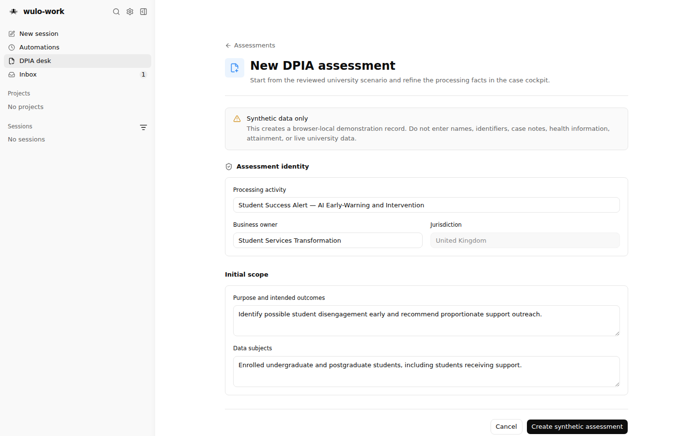

- **What:** `/dpia/new` — intake form for a new screening (purpose, data subjects, sources, processor…).
- **Input:** intake answers become processing-model facts (v1).
- **Outcome:** in the demo only the seeded Student Success Alert case is fully wired; the form shows the intended intake shape.

## 5. Case cockpit — header + readiness banner

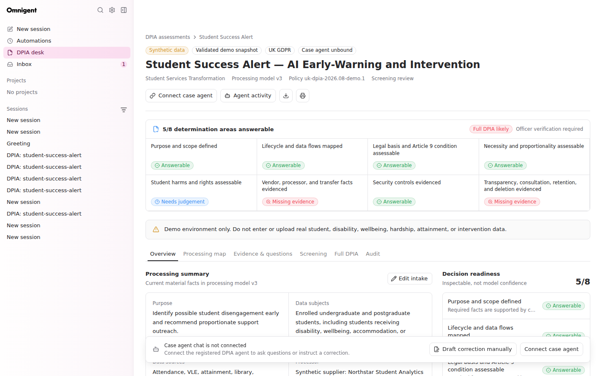

- **What:** `/dpia/cases/student-success-alert`. Header chips state the ground rules: **Synthetic data**, **Validated demo snapshot**, **UK GDPR**, and whether a **case agent** is bound. Actions: *Connect case agent*, *Agent activity*, *Download / Print decision pack*.
- **Readiness banner:** the 8 dimensions with live status chips (Answerable / Needs judgement / Missing evidence / Stale). Clicking one opens its detail.
- **Decision pack:** deterministic markdown export (`decisionPackMarkdown.ts`) of the whole case for records — same content on screen, download, and print.
- **Outcome:** the officer sees in one glance what is provable and what blocks the screening ("5/8 answerable", recommendation "Full DPIA likely — officer verification required").

## 6. Overview tab — processing summary + decision readiness

- **What:** current material facts ("Processing summary", model version shown) next to the per-dimension readiness rail.
- **Input:** *Edit intake* — changing a material fact bumps the model version and marks dependent findings stale (you'll get a toast and Inbox items).
- **Outcome:** the versioned-fact loop is the heart of the product: change a fact → findings stale → replay → decide again.

## 7. Processing map tab

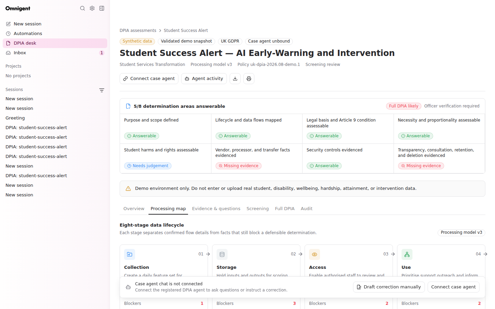

- **What:** the data lifecycle mapped by the Process Investigator: sources → processing → storage/hosting → outputs → retention/deletion.
- **Data:** each node cites the facts and evidence it stands on.
- **Outcome:** answers "do we actually know how data flows?" — gaps here surface as `missing-evidence` dimensions.

## 8. Evidence & questions tab

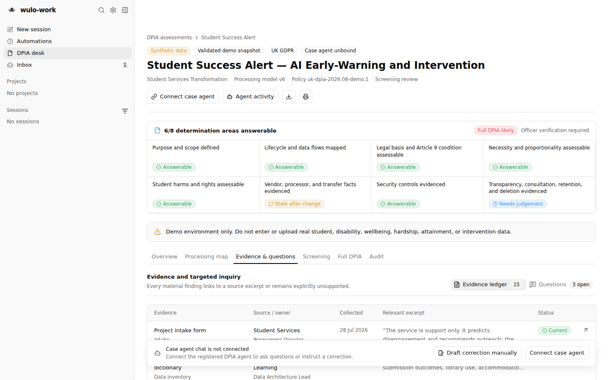

- **What:** the evidence register (each item `current`/`superseded`, linked to the facts it supports) and open **stakeholder questions**.
- **Input:** answering a question records an attributed answer (who said it) which becomes evidence and bumps the model version.
- **Outcome:** answers can flip a dimension from `missing-evidence` to `answerable` — and always invalidate a previous officer decision, because the basis changed.

## 9. Screening tab — findings + officer decision

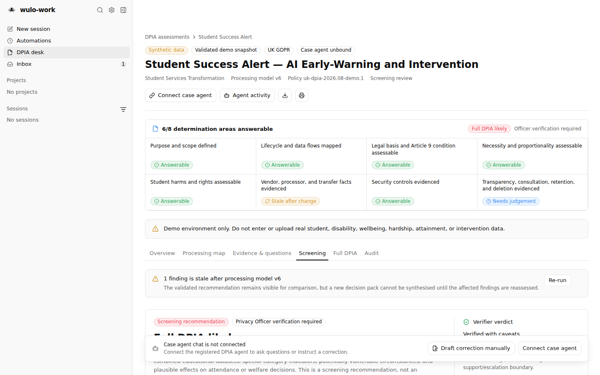

- **What:** the 8 determination findings with their reasoning, plus the **officer decision panel**.
- **Input:** the officer accepts or overrides the recommendation. A rationale of **at least 10 characters** is mandatory for every action.
- **Outcome:** the decision is recorded pinned to the processing-model version and policy-pack version it was made against, with an audit event. Any later material change makes it stale — there is no silent drift.

## 10. Full DPIA tab

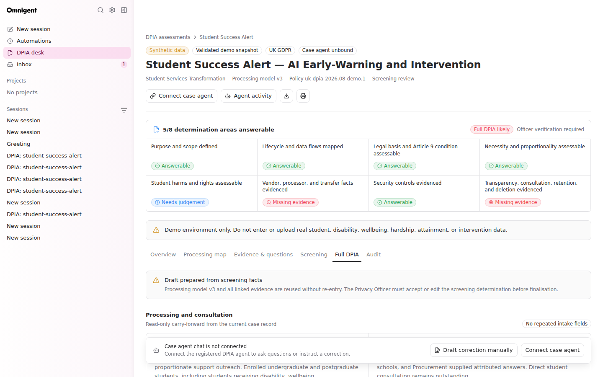

- **What:** the long-form assessment view (necessity/proportionality, harms, rights, mitigations) assembled from the same findings — nothing here is separately editable, it is a projection of the case data.

## 11. Audit tab

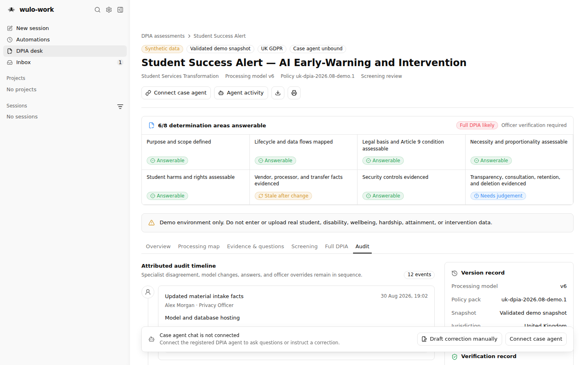

- **What:** append-only audit trail: intake edits, answers, replays, proposals staged/applied/rejected, officer decisions, session bindings.
- **Outcome:** every state change is explainable after the fact; this is what a regulator (or your tech lead) reads.

## 12. Agent activity — live investigation panel

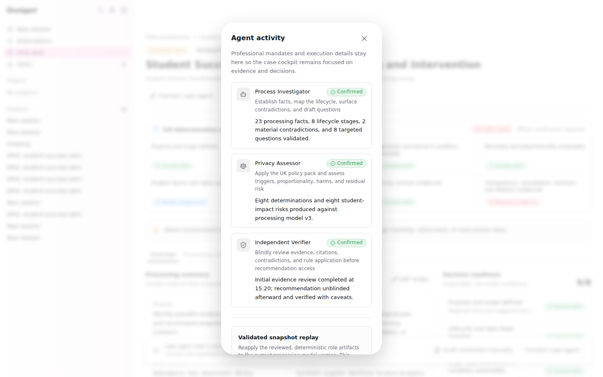

- **What:** the *Agent activity* dialog shows the live-run state machine: `idle` (showing the validated demo snapshot) → `running` (three agents dispatched) → `completed` or `failed`. Cached snapshot, live output, and failure are visually distinct — you always know what you're looking at.
- **How a live run works:** the coordinator sends the Process Investigator first, then the Privacy Assessor (blind, sanitized Stage-1 package frozen by sha256) and the Independent Verifier **in parallel**. Every artifact passes `validate_artifact.py`; a proven blind-compromise aborts with exit code 3 and surfaces here as `failed` (and as a high-severity Inbox item).
- **Outcome:** on success the validated results replay into the case; on failure nothing touches the case.

## 13. Case agent chat — bottom dock

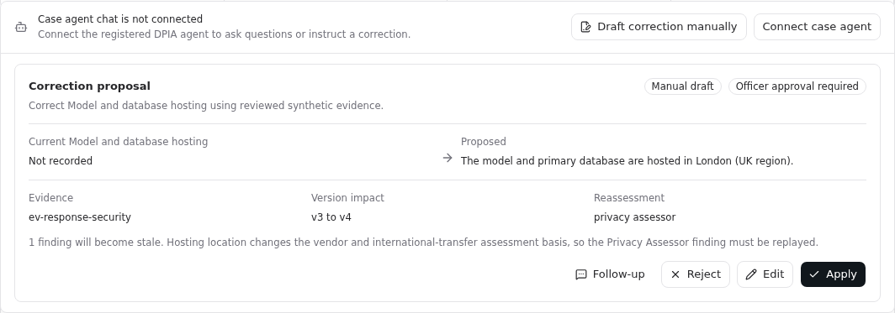

- **What:** a chat dock fixed to the bottom of the case page (`DpiaCaseChat.tsx`). *Connect case agent* binds the case to a real Omnigent session (found or created by labels `omnigent.product=dpia-investigation` + `omnigent.case_id=<caseId>`). An **Open full session** link jumps to the normal `/c/:sessionId` view — the original chat experience, unchanged.
- **Input:** the officer asks questions ("why is vendor evidence missing?") or instructs corrections ("the database is hosted in London, fix the hosting fact").
- **Outcome:** agent replies stream into the dock. If a reply contains a valid `correction-proposal` JSON artifact it is parsed (`parseCorrectionProposalText`) and **staged** — never applied. Invalid or tampered proposals are rejected by the strict schema.

## 14. Correction proposal card

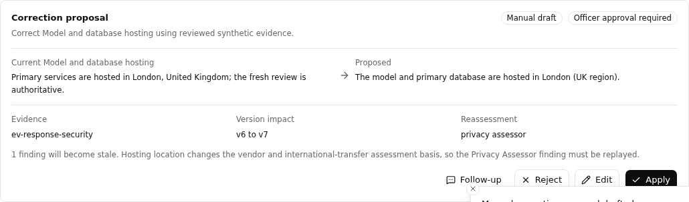

- **What:** every pending proposal renders as this card (`CorrectionProposalCard.tsx`), whether drafted by the agent or manually (*Draft correction manually* button).
- **Data on the card:** target fact **current → proposed** value, supporting evidence id, **version impact** (`v3 to v4` — must be exactly current version +1), which findings go stale, which agent role must reassess, and the rationale.
- **Input:** the officer chooses **Apply**, **Reject**, **Edit**, or **Follow-up** (ask the agent about it in chat).
- **Outcome of Apply:** `applyCorrectionProposal` re-validates the proposal against the *current* snapshot (stale proposals fail fast), updates the fact through the same versioned intake mutation, bumps the model version, marks the named findings stale, and writes two audit events. Reject records an audit event and clears the Inbox item.
- **Guarantee:** the schema is strict (`auto_apply`-style fields are rejected), duplicates are deduped, and there is no code path where an agent mutates the case directly.

---

# The stakeholder workflow

The second feature wave gives stakeholders real in-product journeys. Three roles, one
case, many scoped conversations: a **requester** (e.g. Procurement) applies for a DPIA
through chat, **contributors** (e.g. IT Security) answer officer-shared questions in
their own scoped threads, and the **officer** keeps sole authority to accept evidence,
decide, and publish. All cross-user data rides Omnigent session transcripts as strict
JSON artifacts (`dpia-request`, `stakeholder-response`, `dpia-outcome` — schemas in
`web/src/lib/dpia/requestArtifacts.ts` and `examples/dpia_investigation/schemas/`);
sessions are labelled (`omnigent.dpia.role`, `omnigent.dpia.request_id`,
`omnigent.dpia.request_status`) so each surface finds its own conversations. No new
server endpoints were added.

**The lifecycle at a glance**

```
Requester                      Officer                         Contributor
─────────                      ───────                         ───────────
/dpia/request                  Inbox / DPIA desk               /dpia/respond/:id
  chat or intake card    →       Review request
  Review & submit        →       Accept for screening
                                 Share questions          →      form card / chat
                                 Accept staged answers    ←      Review & submit answers
                                 (version bump, stale,
                                  audit — existing loop)
  Outcome card           ←       Send outcome
  Acknowledge            →       sees acknowledgement
```

Request states: `draft → submitted → accepted → completed` (or `declined` at triage).
Response states: `draft → submitted → accepted | rejected`.

## 15. Requester journey — apply for a DPIA, step by step

*Persona: Priya Shah, Procurement. She wants a vendor tool assessed. Everything below
is synthetic — never enter real project or student data.*

**Step 1 — open the door.** Go to the DPIA desk (`/dpia`) and click **Request a
DPIA**, or navigate straight to `/dpia/request`. The page lists your existing
requests with their status; click **Start a new request**.

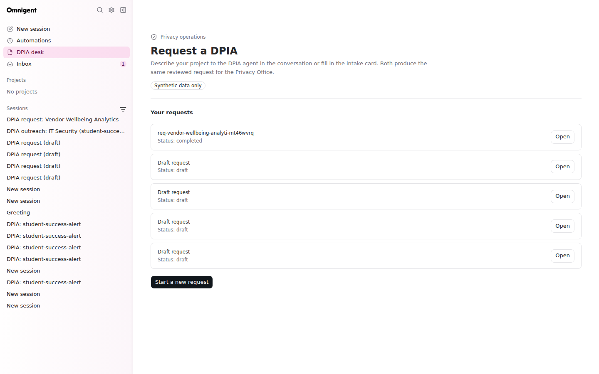

**Step 2 — wait for the conversation to connect.** Starting a request creates a
labelled agent session and attaches a runner (a few seconds — the composer enables
when ready). You now have two equivalent routes:

- **Talk:** type into the conversation, e.g. *"We want a vendor tool that scores
  student wellbeing surveys so support staff can prioritise outreach."* The agent
  interviews you for the missing fields and can draft the request JSON for you.
- **Type into the intake card** (right column) — the structured route used below.

**Step 3 — fill the intake card.** Synthetic example values:

| Field | Example |
|---|---|
| Your name | `Priya Shah` |
| Your team | `Procurement` |
| Project title | `Vendor Wellbeing Analytics` |
| Purpose | `Score student wellbeing survey responses with a vendor model to prioritise support outreach.` |
| Data subjects | `Enrolled students` |
| Personal data involved | `Survey responses, student identifiers, wellbeing scores` |
| Vendors / processors | `Acme Analytics Ltd` |
| Timeline | `Pilot in October` |
| Known unknowns (one per line) | `Hosting location` ⏎ `Subprocessor list` |

Short fields keep the button disabled — the purpose needs a real sentence (≥10
characters), names need ≥2. Declaring *known unknowns* is encouraged: it tells the
officer where outreach will be needed.

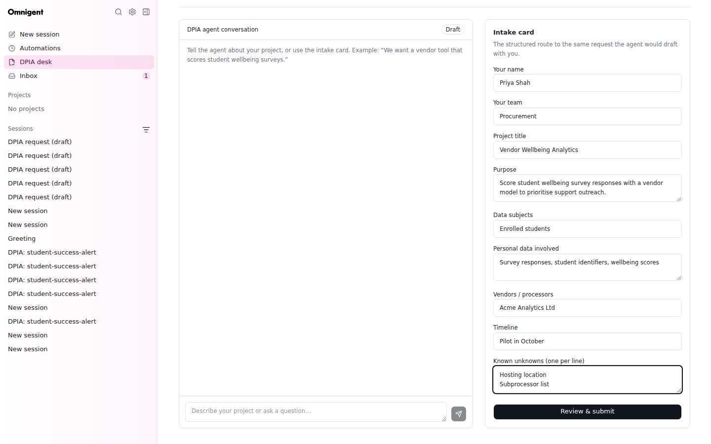

**Step 4 — review and submit.** Click **Review & submit**. The dialog shows *exactly*
what the Privacy Office receives — nothing more is sent. Click **Submit to DPIA
Office**.

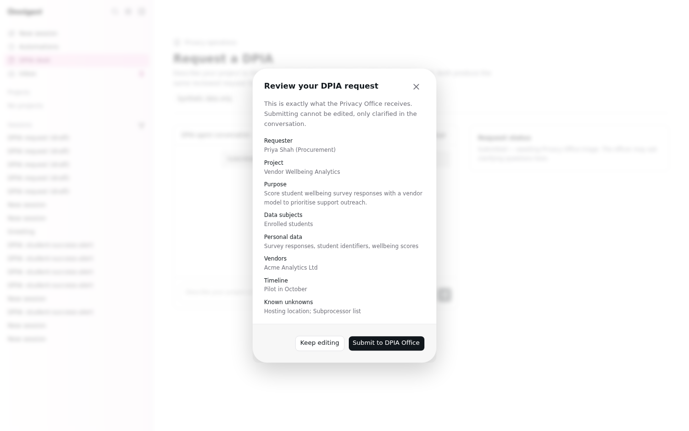

What happens under the hood: the confirmed draft becomes one validated `dpia-request`
JSON artifact posted into your conversation transcript, and the session is labelled
`request_id=req-vendor-wellbeing-…`, `request_status=submitted`. The transcript shows
*"Structured DPIA request submitted to the Privacy Office."*

**Step 5 — track and answer clarifications.** Revisit `/dpia/request` any time and
**Open** your request. The status card reads *Submitted — awaiting Privacy Office
triage*. If the officer asks something (e.g. *"Which team owns the vendor
contract?"*), it appears in your conversation tagged **Privacy Office** — just reply
in the composer.

## 16. Officer triage — handle an incoming request, step by step

*Persona: Alex Morgan, Privacy Officer. Her cockpit is unchanged; it now receives
real inbound.*

**Step 1 — spot the request.** It surfaces in two places within ~20 seconds of
submission: the **Inbox** (*DPIA request awaiting triage*, with requester and purpose)
and the DPIA desk's **Incoming requests** section.

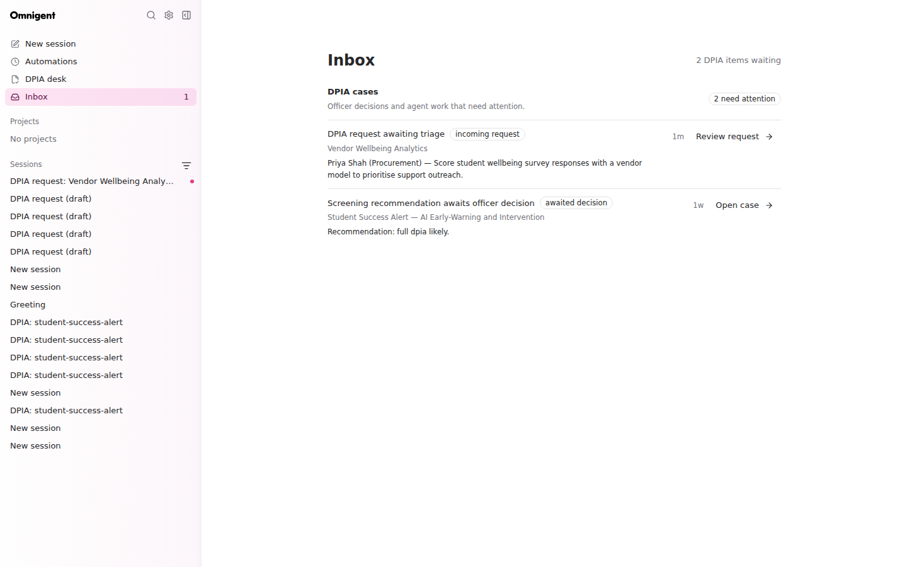
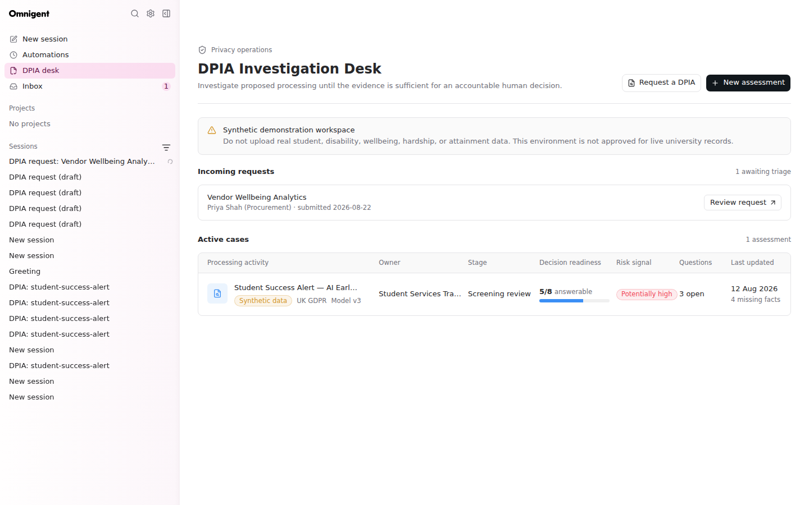

**Step 2 — review.** Click **Review request** to open
`/dpia/requests/req-vendor-wellbeing-…`. Left: the normalized request card — every
field Priya submitted, including her declared unknowns. Right: her full conversation
with the agent, so you see how the request was formed.

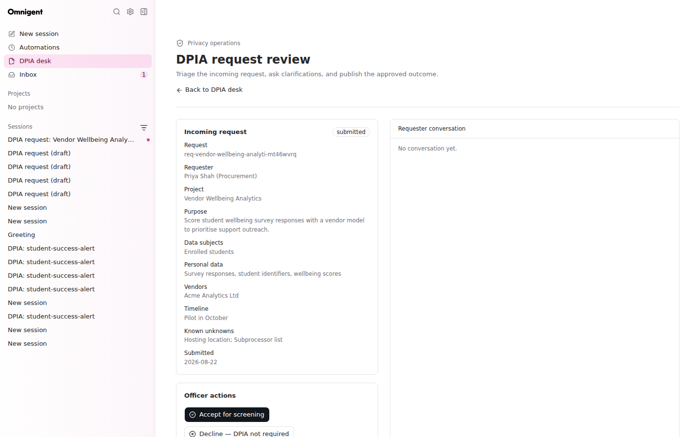

**Step 3 — choose one of three actions.**

| Action | When | What it does |
|---|---|---|
| **Accept for screening** | The request is real and needs assessment | Labels the request `accepted`, attaches it to the screening case, writes a case audit event ("Accepted DPIA request for screening"), and reveals the *Open screening case* / *Send outcome* actions |
| **Ask the requester for clarification** | Something is unclear | Type e.g. `Which team owns the vendor contract?` and click **Send clarification** — it lands in Priya's conversation as a Privacy Office message |
| **Decline — DPIA not required** | Clearly out of scope | Requires a ≥10-character reason (e.g. `The processing involves no personal data at all.`); publishes a `not-required` outcome to the requester and closes the request |

For this walkthrough, click **Accept for screening**.

## 17. Officer outreach — share scoped questions, step by step

**Step 1 — open the case.** Click **Open screening case** (the Student Success Alert
cockpit). Below the tabs sits the new **Stakeholder outreach** panel.

**Step 2 — share.** Click **Share questions with a stakeholder**:

1. Stakeholder team: `IT Security`
2. Tick the open questions to share — e.g. the hosting question (*"Where are the
   model and primary database hosted…"*)
3. Click **Create scoped outreach**

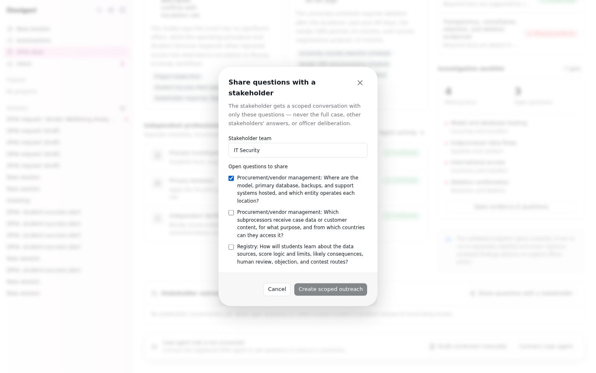

**Step 3 — send the link.** The dialog returns a link like
`/dpia/respond/93dcf47f…` — send it to the stakeholder (in the demo, open it in
another browser or tab). What the contributor receives is a **separate session**
seeded with an officer briefing carrying *only* the selected questions — never the
full case, other stakeholders' answers, or officer deliberation. An audit event
("Shared scoped questions with stakeholder") is recorded on the case.

## 18. Contributor journey — answer the Privacy Office, step by step

*Persona: Jordan Ali, IT Security. He received the link from Alex.*

**Step 1 — open the link.** `/dpia/respond/:sessionId` greets him with the case name
and a form card listing exactly the shared questions.

**Step 2 — (optional) ask first.** The conversation is live — he can ask the agent
things like *"Does a UK-region cloud count as UK hosting?"* before committing.

**Step 3 — answer.** Fill the card:

- Your name: `Jordan Ali` — Your team: `IT Security`
- Hosting question: `Confirmed with the vendor: the model and primary database are
  hosted in London (UK region).` (each answer needs ≥10 characters)

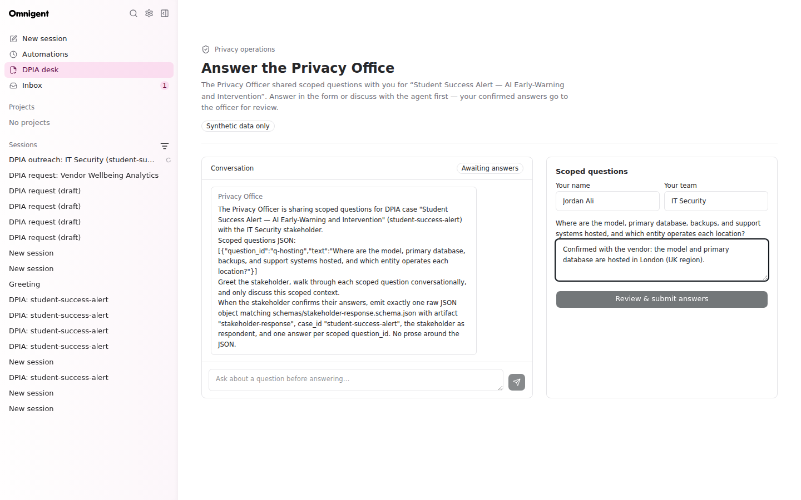

**Step 4 — review and submit.** **Review & submit answers** shows the confirmation
dialog with his attribution; **Submit answers** posts one `stakeholder-response`
artifact and flips the panel to *Answers submitted* with a read-back of what he sent.
Nothing on the case changes yet — the card says so explicitly.

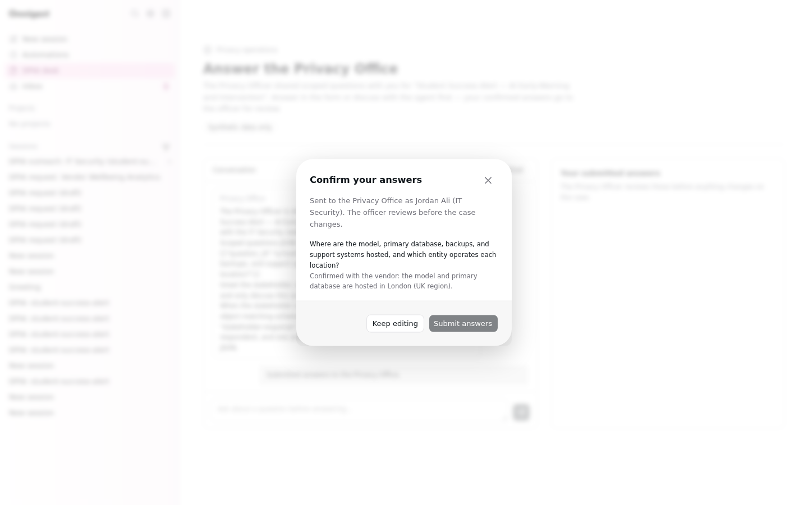

## 19. Officer reconciliation — accept staged answers, step by step

**Step 1 — spot the response.** The Inbox shows *Stakeholder response awaiting
review*, and the case's outreach panel shows the IT Security row as **submitted**
with every question, answer, and *Answered by Jordan Ali (IT Security)*.

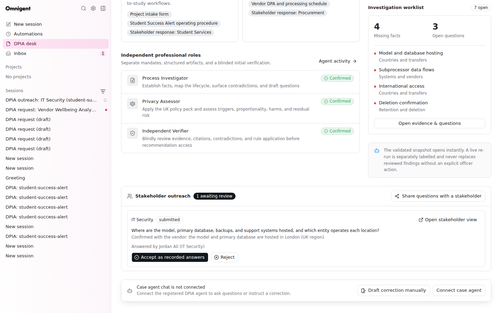

**Step 2 — accept or reject.**

- **Accept as recorded answers** routes each answer through the same machinery the
  cockpit has always used: an attributed answer is recorded, the **processing model
  version bumps**, dependent findings go **stale**, audit events are written — and a
  confirmation is posted back into Jordan's conversation. The row flips to
  **accepted**:

  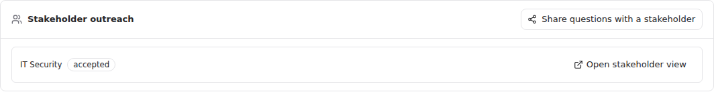

- **Reject** labels the response rejected and tells the contributor to revise —
  nothing touches the case.

**Step 3 — continue the normal loop.** The stale findings appear in the Inbox as
before; replay the investigation, resolve the readiness dimensions, and record the
officer decision on the Screening tab (see section 9).

## 20. Outcome delivery and acknowledgement, step by step

**Step 1 — send the outcome.** Back on the request review page, click **Send outcome
to requester**. The dialog drafts a *requester-safe* summary:

- Decision: `Approved with conditions` (reasons prefill from your recorded decision
  rationale)
- Reasons: `Screening indicates a full DPIA is likely before launch; hosting evidence
  is now recorded.`
- Condition: `Resolve the outstanding evidence gaps identified in screening.` —
  owner `Procurement`, due `2026-10-01`
- Review date: `2027-02-01`

Internal evidence, contradictions, and deliberation are **not** included — only this
summary crosses the boundary.

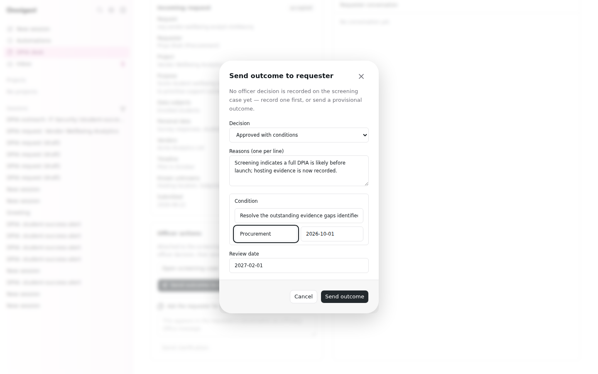

**Step 2 — requester receives it.** Priya's request page now shows the outcome card:
decision badge, reasons, conditions with owners and due dates, review date, and
contact.

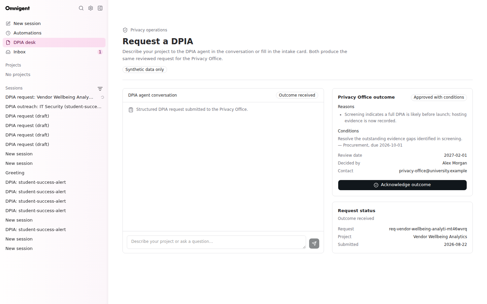

**Step 3 — acknowledge.** She clicks **Acknowledge outcome**; the button flips to
*Acknowledged* and Alex sees *"Outcome sent and acknowledged by the requester"* on
the review page. The request lifecycle is complete: `draft → submitted → accepted →
completed`.

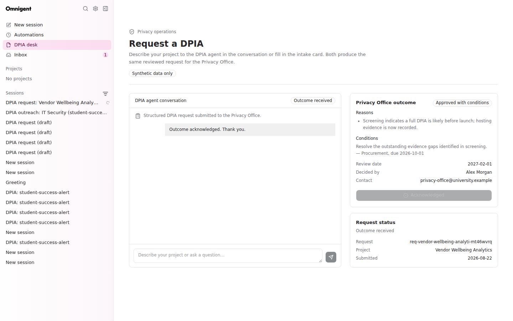

The completed request stays inspectable end-to-end: the review page keeps the full
conversation and artifacts —

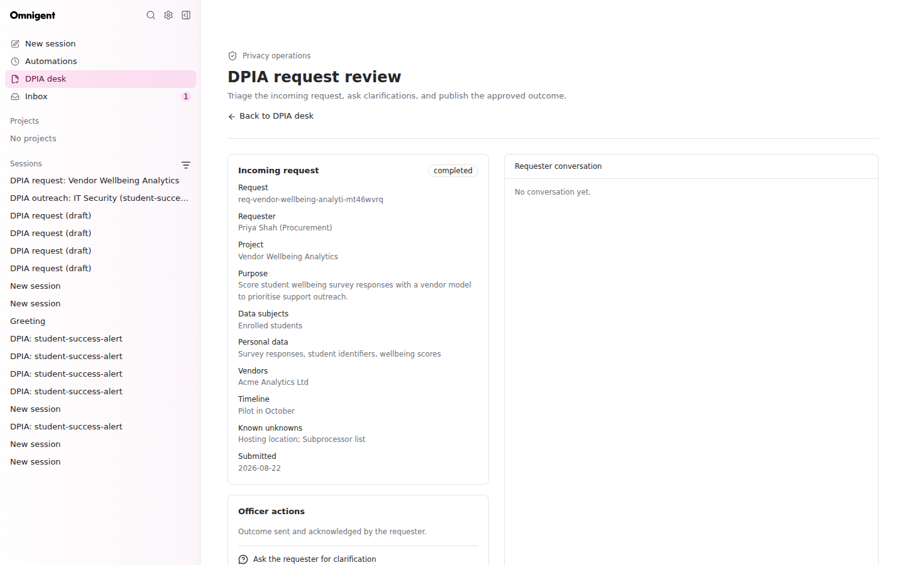

## Troubleshooting the workflow

- **Composer stays disabled / "No runner is online".** The session needs a runner.
  Session creation binds a pool runner or launches one on the host automatically; if
  it still fails, check `omnigent run examples/dpia_investigation --server …` is
  running and click *Retry connection*.
- **The officer doesn't see a request.** Only `submitted` requests surface — drafts
  never do. The Inbox/desk polls every ~20 seconds; reload to force it.
- **Accept fails with "unknown questions".** The response references question ids
  that don't exist on the case (e.g. the question was answered another way first).
  Reject it and share a fresh scoped outreach.
- **Everything is synthetic.** The agent refuses real personal data by instruction,
  and every page carries the *Synthetic data only* banner. Do not paste real student,
  disability, wellbeing, hardship, or attainment data anywhere.

---

## Where to look in the code

| Concern | File |
|---|---|
| Snapshot load/save, all mutations | `web/src/lib/dpia/dpiaApi.ts` |
| Readiness derivation | `web/src/lib/dpia/readiness.ts` |
| Inbox attention items | `web/src/lib/dpia/inbox.ts` |
| Zod schemas (strict) | `web/src/lib/dpia/schemas.ts` |
| Session find-or-create by labels | `web/src/lib/dpia/caseSession.ts` |
| Proposal parsing from chat | `web/src/lib/dpia/correctionProposal.ts` || Request/response/outcome artifacts | `web/src/lib/dpia/requestArtifacts.ts` |
| Role-labelled session transport | `web/src/lib/dpia/requestSession.ts` |
| Officer request/response polling | `web/src/lib/dpia/requestInbox.ts`, `web/src/hooks/useDpiaRequests.ts` |
| Requester page | `web/src/pages/dpia/DpiaRequestPage.tsx` |
| Officer request review | `web/src/pages/dpia/DpiaRequestReviewPage.tsx` |
| Contributor respond page | `web/src/pages/dpia/DpiaRespondPage.tsx` |
| Outreach + reconciliation panel | `web/src/pages/dpia/StakeholderOutreachPanel.tsx` |
| Shared chat stream hook | `web/src/pages/dpia/useDpiaSessionChat.ts` || Case page + tabs | `web/src/pages/dpia/DpiaCasePage.tsx` |
| Chat dock | `web/src/pages/dpia/DpiaCaseChat.tsx` |
| Proposal card | `web/src/pages/dpia/CorrectionProposalCard.tsx` |
| Agent bundle + blind protocol | `examples/dpia_investigation/` |
| Artifact validation gates | `examples/dpia_investigation/schemas/validate_artifact.py` |
